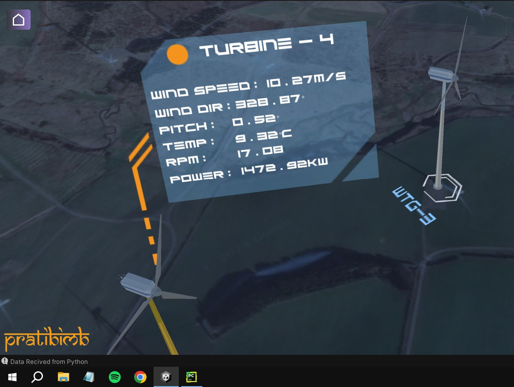

# Pratibimb - Digital Twin of Wind Turbine 

This project focuses on the development of a digital twin for a wind turbine. It uses a physics-based simulation engine to monitor the turbine's behavior under various wind conditions and operational timeframe. This allows for the evaluation of different control systems, optimization of operational components, and prediction of power output under changing weather/wind conditions using Deep Learning. It also has interactive 3D visualization with environment integration of all aspects of the digital twin. This interface provides intuitive interaction with the virtual turbine model.

**Providing following solutions** 
- Real-Time Monitoring and Control, 
- Dynamic Simulation 
- PINN based Predictive Analytics
- Fault Predicition


## Demo 

Video

[](https://youtu.be/0HGZrRCFVSQ)


Real Time (Scene)




Simulation (Scene)


Home 


## Installation 

**Prerequisite***
- Unity
- DT-WTP-prediction-API --> https://github.com/Parth673/Digital-Twin-WTP-prediction-API
- GoogeSheets API (free)
- visualcrossing.com API (free)


**Step 1: Download and extract github file in a folder** 


**Step 2: Unzip PratibimbUnity.zip**


**Step 3: Open Unity Hub > Add > folder (PratibimbUnity)**


**Step 4: Import following packages**

Window > Package Manager > My Assets 
- AnyUI Package (UnityAssetStore)
- Graph and Chart (UnityAssetStore)
- Morden UI Pack (UnityAssetStore)


**Step 5: Add your GoogeSheets API Credential json file path.**

Scripts > Database > DataSheetsReader.cs
```
private readonly string CredentialsFilePath = "Your Path/Credent.json";
```


**Step 6: Add visualcrossing API KEY**
Scripts > Database > WeatherForecast.cs
```
private string apiKEY = <YOUR API KEY>
```


**Step 7: Run your DT-WTP-prediction-API on local computer on any code editor**
```bash
python app.py
```


## Social Media

 - [Youtube](https://www.youtube.com/@popothebird)
 - [Twitter / X](https://twitter.com/popothebird)
 - [Linked In](https://www.linkedin.com/in/parth-kakadia/)


